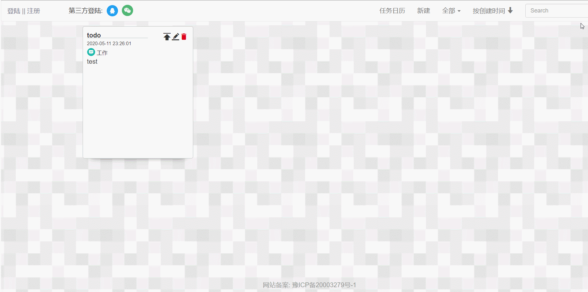
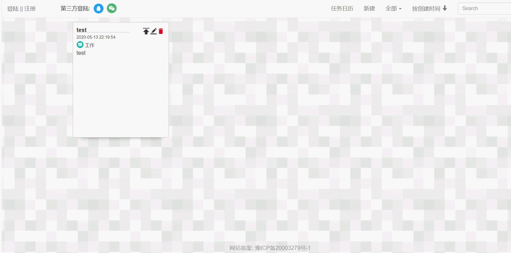
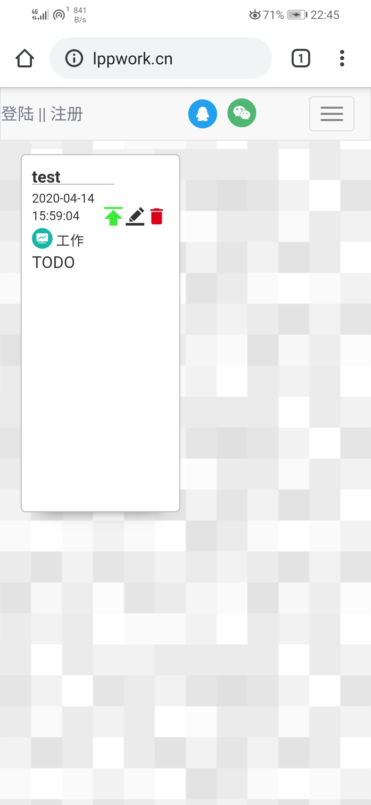

# 介绍
**memoGo: 基于vue框架的备忘录网站，支持第三方登陆、云同步，支持日历任务功能**
**网站地址:[memoGo](http://lppwork.cn/)**
# 浏览图



# 实现功能
+	时间排序、分类显示、备忘录置顶等功能
+	支持线上云同步
+	支持第三方登陆(目前仅QQ)
+	实现日历任务功能，可为自己添加行程安排
+	兼容手机端
	

# todo
+	实现分类标签自定义
+	微信的第三方登陆
+	日历任务功能插件化


## Project setup
```
npm install
```

### Compiles and hot-reloads for development
```
npm run serve
```

### Compiles and minifies for production
```
npm run build
```

### Lints and fixes files
```
npm run lint
```

### Customize configuration
See [Configuration Reference](https://cli.vuejs.org/config/).
